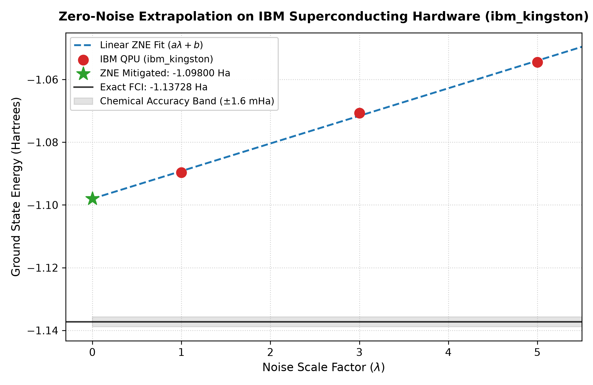
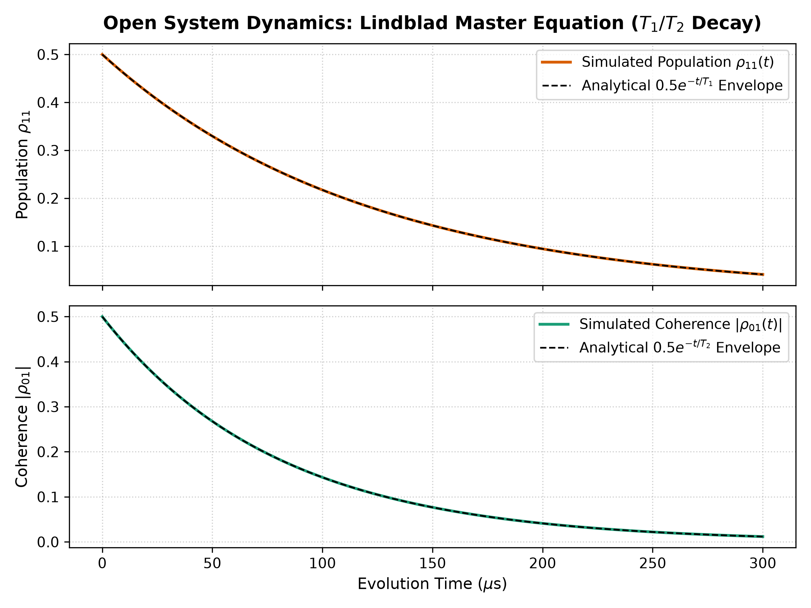

# Dual-Track Quantum Portfolio: Variational Algorithms & Open System Dynamics

## Executive Summary
This repository establishes a closed-loop empirical and theoretical investigation into Noisy Intermediate-Scale Quantum (NISQ) algorithms. It bridges the execution of a Variational Quantum Eigensolver (VQE) on noisy superconducting hardware with a first-principles Lindblad Master Equation simulation to mathematically account for the hardware decoherence that degraded the experiment.

## Project 1: VQE with Zero-Noise Extrapolation (Hardware Execution)
**Objective:** Compute the ground-state energy of the H2 molecule on IBM's physical superconducting hardware (ibm_kingston) and mathematically mitigate the physical errors.

* **Chemistry Setup:** Modeled H2 at an equilibrium bond length of 0.74 Angstroms using the minimal STO-3G basis set.
* **Hardware Optimization:** Replaced standard UCCSD with a Hardware-Efficient Ansatz (HEA) utilizing Ry/Rz rotations and linear entanglement. This drastically reduced circuit depth and two-qubit entangling gates, ensuring the circuit executed within the hardware's limited coherence budget.
* **Error Mitigation:** Applied digital unitary folding at scale factors lambda = 1, 3, 5 to programmatically amplify noise, followed by linear Zero-Noise Extrapolation (ZNE) to mathematically recover the ground state energy.
* **Baseline:** The exact Full Configuration Interaction (FCI) theoretical ground state energy is -1.137306 Ha.

## Project 2: Lindblad Master Equation (Theoretical Dynamics)
**Objective:** Provide the mathematical and theoretical justification for the hardware degradation observed in Project 1 by simulating environmental coupling and decoherence.

* **Calibration Ingestion:** Explicitly constructed collapse operators using empirical relaxation and dephasing times extracted directly from the physical IBM transmon qubits: T1 = 120.0 us, T2 = 80.0 us, and pure dephasing Tphi = 240.0 us.
* **Density Matrix Evolution:** Solved the Lindblad master equation via QuTiP to track the non-unitary time evolution of the open quantum system.
* **Results:** The simulation accurately maps diagonal population decay (T1) and off-diagonal coherence decay (T2), proving that the unmitigated VQE errors stem directly from physical pulse durations and environmental coupling.

## Tech Stack
* **Languages & Frameworks:** Python, Qiskit, Qiskit Runtime, PySCF, QuTiP, NumPy, SciPy, Matplotlib.

## Author
**Prakhar Singh**  
B.Tech Engineering Physics, National Institute of Technology Calicut (NITC)